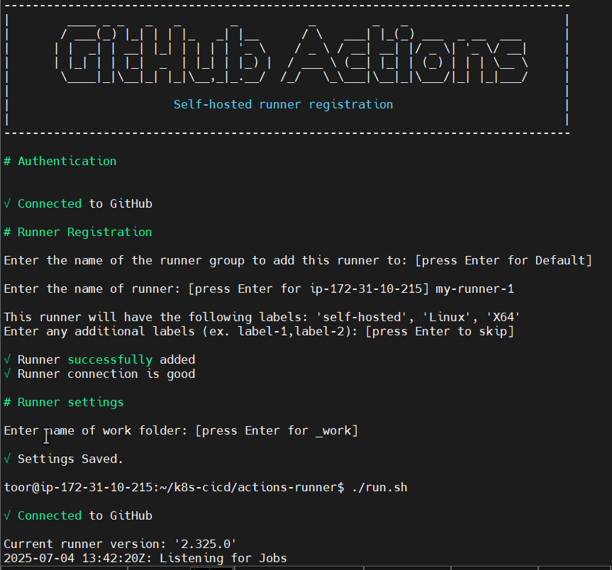
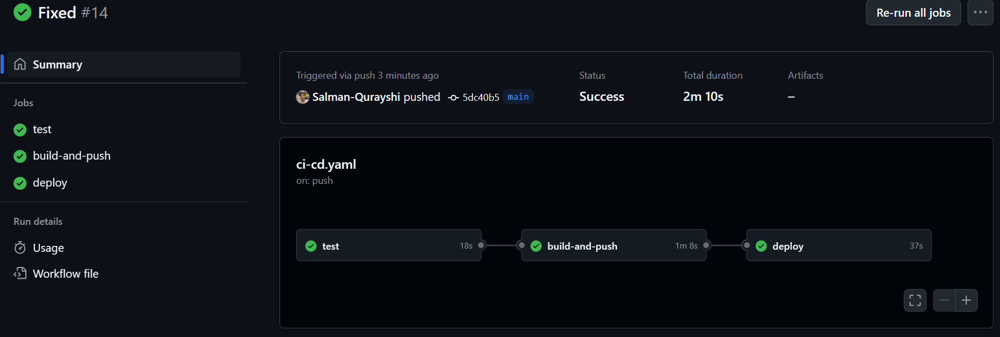
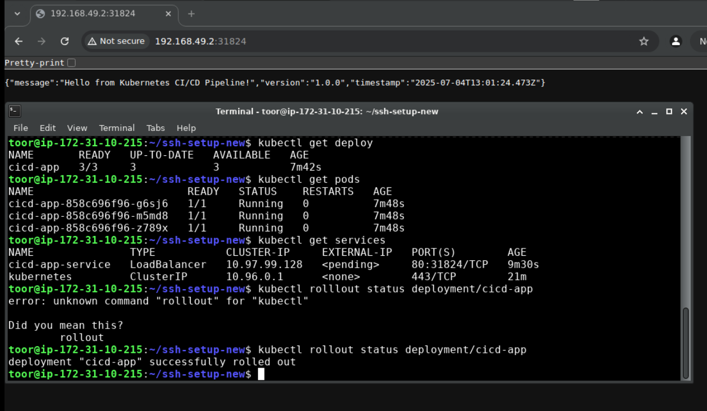

# Kubernetes CI/CD Pipeline with GitHub Actions

## Overview
This project demonstrates a complete Continuous Integration/Continuous Delivery (CI/CD) pipeline for a Node.js application, leveraging GitHub Actions for automation and Kubernetes for deployment. The pipeline automates the testing, building, pushing of Docker images to Docker Hub, and deploying updates to a Kubernetes cluster. It also includes capabilities for automated rollbacks.

My goal was to build a robust system that ensures every code change is automatically validated and deployed, minimizing manual intervention and ensuring quick recovery from issues.

## Features
* **Automated Testing & Linting:** Runs `npm test` and `npm audit` on every code push to ensure code quality and security.
* **Docker Image Building:** Builds multi-architecture (linux/amd64, linux/arm64) Docker images for the Node.js application.
* **Container Registry Integration:** Automatically pushes built Docker images to Docker Hub.
* **Kubernetes Deployment:** Deploys and updates the application on a Kubernetes cluster, leveraging `kubectl`.
* **Immutable Versioning:** Utilizes Git commit SHAs for unique Docker image tagging, ensuring that each deployed version is precisely tied to a specific code state, enabling reliable rollbacks.
* **Automated Rollbacks:** Implements a GitHub Actions workflow to easily revert to previous stable application versions in Kubernetes.
* **Self-Hosted Runner Integration:** Demonstrates using a self-hosted GitHub Actions runner for pipeline execution.

## Project Structure

```
|-- Dockerfile
|-- app.js
|-- k8s-manifests
|   |-- deployment.yaml
|   -- service.yaml
|-- package-lock.json
|-- package.json
|--screenshots
|  |-- cli-web-browser.png
|  |-- github-runner-cli.png
|  |-- pipeline-jobs.png
```

## Architecture & Workflow
The CI/CD pipeline is orchestrated using GitHub Actions.
1.  **Code Push:** A push to `main` or `develop` branch (or a Pull Request to `main`) triggers the workflow.
2.  **Test Job:**
    * Checks out the code.
    * Sets up Node.js.
    * Installs dependencies (`npm ci`).
    * Runs unit tests (`npm test`).
    * Performs a security audit (`npm audit`).
3.  **Build and Push Job:**
    * **_Depends on Test Job success._**
    * Logs into Docker Hub using secrets.
    * Uses `docker/metadata-action` to generate Docker image tags based on branch name, commit SHA (e.g., `main-e193956`), and `latest`.
    * Builds and pushes the Docker image to Docker Hub.
4.  **Deploy Job:**
    * **_Depends on Build and Push Job success._**
    * Sets up `kubectl`.
    * Configures `kubectl` using a base64-encoded `KUBECONFIG` secret.
    * **Crucially, it dynamically determines the exact Docker image tag** (e.g., `docker.io/salmanalqureshi/cicd-app:main-e193956`) using the `github.sha` and `github.ref_name` context variables. This ensures the correct, immutable image is deployed.
    * Updates the `k8s-manifests/deployment.yaml` with the precise image tag and the `APP_VERSION` environment variable.
    * Applies the Kubernetes manifests using `kubectl apply`.
    * Monitors the rollout status.
    * Verifies the deployment using `kubectl get pods` and `kubectl get services`.
5.  **Rollback Workflow (Manual Trigger):** A separate workflow (`rollback.yaml`) allows for manual or automated rollbacks to a specified Kubernetes deployment revision.

## Getting Started

### Prerequisites
* **GitHub Account:** (Free tier is sufficient)
* **Docker Hub Account:** To store your Docker images.
* **Local Kubernetes Cluster:** Minikube is used in this lab.
* **Self-Hosted GitHub Actions Runner:** Configured and connected to your GitHub repository.
* **Basic Git, Docker, Kubernetes, and YAML knowledge.**


### Setup Steps

1.  **Ensure Project Files are in Repository:**
    Verify that your GitHub repository contains the application code (`app.js`, `package.json`, `package-lock.json`), `Dockerfile`, Kubernetes manifests (`k8s-manifests/deployment.yaml`, `k8s-manifests/service.yaml`), and the GitHub Actions workflows (`.github/workflows/ci-cd.yaml`, `.github/workflows/rollback.yaml`) as structured in the `Project Structure` section above.

2.  **Configure Local Kubernetes Environment (Minikube):**
    Start your Minikube cluster and ensure `kubectl` is configured to interact with it. Enable necessary addons like `ingress` and `metrics-server`.
    ```bash
    # Start Minikube cluster (adjust resources as needed)
    minikube start --driver=docker --memory=4096 --cpus=2

    # Verify cluster status
    kubectl cluster-info
    kubectl get nodes

    # Enable recommended Minikube addons
    minikube addons enable ingress
    minikube addons enable metrics-server

    # Configure your local Docker daemon to use Minikube's Docker environment
    # This allows 'docker build' to use Minikube's Docker daemon, not your host's.
    eval $(minikube docker-env)
    ```

3.  **Connect Self-Hosted GitHub Actions Runner:**
    Follow GitHub's official documentation to set up and connect a self-hosted runner to your repository. Ensure it's running and listening for jobs.
    
    
    

5.  **Configure GitHub Repository Secrets:**
    In your GitHub repository, navigate to `Settings` -> `Secrets and variables` -> `Actions` and add the following repository secrets:
    * `DOCKER_USERNAME`: Your Docker Hub username.
    * `DOCKER_PASSWORD`: Your Docker Hub password or a personal access token.
    * `KUBECONFIG`: Your base64-encoded Kubernetes kubeconfig file.
        * You can generate this from your local machine (where `kubectl` is configured for your Minikube) using:
            ```bash
            cat ~/.kube/config | base64 -w 0
            ```

### Running the CI/CD Pipeline

1.  **Trigger the Pipeline:**
    Make a small, functional change to your `app.js` file (e.g., update the version string from `1.0.0` to `1.1.0` in the `app.get` response and in `package.json` if desired) and push it to your `main` branch. This will automatically trigger the `CI/CD Pipeline` workflow.
    ```bash
    # Example: Update app.js (replace `your_username` with your Docker Hub username)
    sed -i "s|image: cicd-app:latest|image: docker.io/your_username/cicd-app:latest|g" k8s-manifests/deployment.yaml
    sed -i 's|version: process.env.APP_VERSION || '\''1.0.0'\''|version: process.env.APP_VERSION || '\''1.1.0'\''|g' app.js
    
    git add .
    git commit -m "feat: Update application version to 1.1.0 and configure image"
    git push origin main
    ```
    * **What happens:** GitHub Actions will detect the push and start the workflow. You can monitor the progress on the `Actions` tab of your GitHub repository. The `test`, `build-and-push`, and `deploy` jobs will execute sequentially.

2.  **Verify Automated Deployment:**
    Once the `deploy` job reports success in GitHub Actions, confirm the new version is running on your Kubernetes cluster.
    ```bash
    # Check deployment status
    kubectl get deployments cicd-app
    kubectl rollout status deployment/cicd-app

    # List running pods
    kubectl get pods -l app=cicd-app

    # Get the URL of your deployed service
    SERVICE_URL=$(minikube service cicd-app-service --url)
    echo "Application URL: $SERVICE_URL"

    # Access the application via curl to verify the version
    curl $SERVICE_URL
    ```
    * **Expected Output:** The `curl` command should return a JSON response indicating the updated version (e.g., `1.1.0`).
  
      
    * **Screenshots:**
      
      

      

